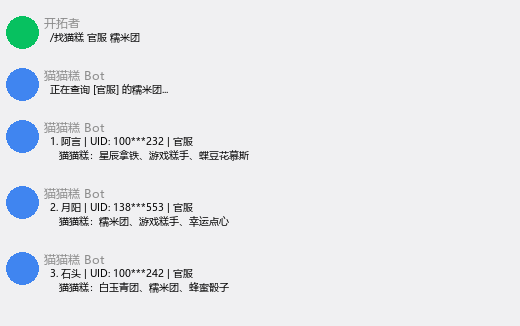

# 星穹铁道猫猫糕查询

[](https://github.com/sfw2099/astrbot_plugin_csr_catcake)
[](https://www.python.org/)
[](LICENSE)

AstrBot 插件：查询/登记/删除猫猫糕，支持角色名搜索和阿基喵利今日限定，返回 UID 及猫猫糕拼图。

数据来源：[猫猫糕友人帐](https://catcake.hoshimi.io/)

## 安装

在 AstrBot WebUI 插件市场搜索 `astrbot_plugin_csr_catcake` 安装。

## 指令

| 指令 | 说明 |
|------|------|
| `/找猫糕帮助` | 查看插件帮助 |
| `/找猫糕 <服务器> <角色/猫猫糕> [数量]` | 查询猫猫糕 |
| `/登记猫猫糕 <玩家名> <UID> <猫猫糕1> <猫猫糕2> <猫猫糕3>` | 登记猫猫糕 |
| `/登记阿基喵利 <玩家名> <UID>` | 登记今日限定阿基喵利 |
| `/删除猫猫糕 <UID>` | 删除自己登记的记录 |

## 查询示例



```
/找猫糕 官服 糯米团         # 按猫猫糕名查询
/找猫糕 官服 丹恒           # 角色名自动映射 -> 糯米团
/找猫糕 官服 丹恒 5         # 指定返回5条
/找猫糕 B服 姬子            # 角色 -> 星辰拿铁
/找猫糕 全部 阿基维利       # 跨服查阿基喵利（今日限定）
/找猫糕 垃圾糕              # 使用默认服务器
```

### 角色名映射

输入角色名可自动查找对应猫猫糕：

| 角色 | 猫猫糕 |
|------|--------|
| 丹恒 | 糯米团 |
| 姬子 | 星辰拿铁 |
| 卡芙卡 | 墨镜猫咪 |
| 银狼 | 游戏糕手 |
| 刃 | 芝麻酥 |
| 阿基维利 | 阿基喵利 |
| 开拓者 | 垃圾糕 |
| 阮梅 | 拉姆之友 |
| 流萤 | 萤绒绒 |

（支持全部 28 种猫猫糕的角色映射）

## 登记示例

```
/登记猫猫糕 开拓者 123456789 糯米团 芝麻酥 冰糕
/登记阿基喵利 开拓者 123456789
/删除猫猫糕 123456789
```

## 服务器

官服 / B服 / 亚服 / 美服 / 欧服 / 港澳台 / 其他 / 全部

## 配置

| 配置项 | 类型 | 默认 | 说明 |
|--------|------|------|------|
| default_server | string | 官服 | 未指定服务器时的默认 |
| default_limit | int | 3 | 默认返回条数（上限9） |
| send_images | bool | true | 是否发送猫猫糕拼图 |

## License

MIT